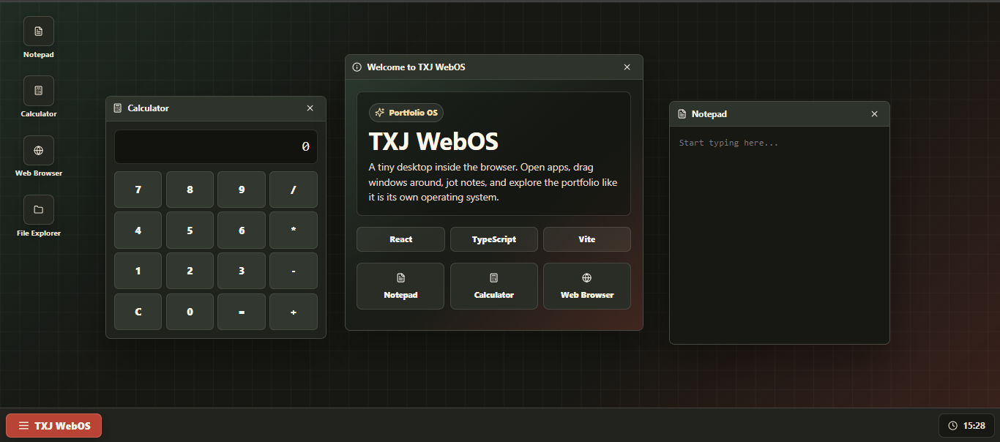

# TXJ WebOS Portfolio

An experimental browser-based desktop portfolio built with React, TypeScript, and Vite. It includes draggable windows, a start menu, desktop shortcuts, a notepad, and a calculator.
##
<p align="center">
  
</p>

## Features

- Desktop-style window manager
- Start menu and taskbar clock
- Built-in notepad and calculator apps
- Responsive layout for desktop and mobile browsers
- Strict TypeScript configuration

## Apps Prestsent
- notepad
- calculator

## Getting Started

Install dependencies:

```bash
npm install
```

Run the development server:

```bash
npm run dev
```

Create a production build:

```bash
npm run build
```
Incase:
Preview the production build locally:

```bash
npm run preview
```

## Project Structure

```text
src/
  App.tsx
  main.tsx
  styles.css

```

## License

MIT License

## Credits

- Programed by [Srinjoy Das](https://github.com/srinj-ai)
